# 🤖 Automated Inquiries Processing Platform

A **production-grade** MLOps pipeline for automated inquiry processing with Kubernetes, full CNCF stack (Istio, ArgoCD, Prometheus), and intelligent ML classification.

[]() 
[]()
[]()
[]()

---

## 🌟 Features

- ✅ **Full CNCF Stack**: Kubernetes, Istio, ArgoCD, Prometheus, Helm, Grafana
- ✅ **Adaptive ML**: BERT models (16GB+ RAM) or rule-based (<16GB RAM)
- ✅ **GitOps Ready**: Auto-deploy from GitHub with ArgoCD
- ✅ **Service Mesh**: Istio for traffic management, security, observability
- ✅ **Complete Monitoring**: Prometheus metrics + Grafana dashboards
- ✅ **Workflow Orchestration**: Apache Airflow with 3 production DAGs
- ✅ **macOS Optimized**: Custom startup script with Docker Desktop integration

---

## 🚀 Quick Start

### Prerequisites

**macOS:**
- Docker Desktop (12GB+ RAM recommended)
- Homebrew
- Git

**The script auto-installs**: Kind, kubectl, Helm, Istio

### One-Command Deployment

**macOS:**
```bash
./start-macos.sh
```

**Linux:**
```bash
./start-linux.sh
```

**This deploys everything:**
- ✅ Kind cluster with full CNCF stack
- ✅ Istio service mesh
- ✅ ArgoCD GitOps
- ✅ Prometheus + Grafana monitoring
- ✅ Apache Airflow (custom image with BERT models)
- ✅ PostgreSQL + Redis
- ✅ Streamlit dashboard + FastAPI backend
- ✅ All port-forwards configured

---

## 🌐 Access Everything

Once deployed, access services at:

| Service | URL | Credentials | Purpose |
|---------|-----|-------------|---------|
| **Streamlit Dashboard** | http://localhost:8501 | - | Main UI & analytics |
| **Streamlit (via Istio)** | http://localhost:30080 | - | Through service mesh |
| **Airflow** | http://localhost:8080 | admin/admin | DAG management |
| **Grafana** | http://localhost:3000 | admin/admin | Metrics & monitoring |
| **ArgoCD** | https://localhost:30009 | admin/[see docs] | GitOps deployments |

> 📚 **Full credentials**: See [docs/FINAL_SETUP_SUMMARY.md](docs/FINAL_SETUP_SUMMARY.md)

---

## 📊 What You Get

### **16 Inquiries Processed** (Sample Data)
- ✅ Classified into categories (Technical Support, Billing, Sales, etc.)
- ✅ Sentiment analysis (neutral, urgent, frustrated)
- ✅ Routing decisions to appropriate departments
- ✅ 100% success rate with rule-based classification

### **3 Production-Ready Airflow DAGs**
1. **daily_data_ingestion** - Creates new inquiries
2. **batch_classify_inquiries** - AI/ML classification (adaptive)
3. **model_retraining** - Retrains models periodically

### **Enterprise Infrastructure**
- **2 Streamlit replicas** (auto-scaled via GitOps)
- **Zero downtime** (0 scheduler restarts)
- **Full observability** (all services monitored)
- **GitOps enabled** (push to GitHub → auto-deploy!)

---

## 📁 Project Structure

```
automated_inquiries_processing/
├── README.md                          # This file
├── start-macos.sh                     # 🚀 macOS startup
├── start-linux.sh                     # 🔄 Linux startup  
├── stop.sh                            # Stop everything
├── keep-port-forwards-alive.sh        # Port-forward manager
│
├── docs/                              # 📚 Complete documentation (8 guides)
│   ├── MACOS_SETUP_GUIDE.md          # Complete macOS setup
│   ├── CNCF_SERVICES_GUIDE.md        # Helm, ArgoCD, Istio usage
│   ├── ARGOCD_DEMO.md                # GitOps workflow demo
│   ├── FINAL_SETUP_SUMMARY.md        # Complete system overview
│   ├── DIRECTORY_STRUCTURE.md        # Project organization
│   ├── SECURITY.md                   # 🔐 Security best practices
│   └── ...
│
├── docker/
│   └── airflow-ml.Dockerfile         # Custom Airflow with BERT
│
├── k8s/                               # Kubernetes manifests (only active files)
│   ├── airflow/
│   │   └── airflow-with-dags-fix.yaml  # Airflow deployment
│   ├── argocd/
│   │   └── streamlit-gitops.yaml       # ✅ ArgoCD app (synced!)
│   ├── database/
│   │   └── init-database-job.yaml
│   ├── istio/
│   │   └── gateway-fix.yaml            # Service mesh gateway
│   └── services/
│       ├── streamlit-dashboard.yaml    # ✅ 2 replicas via GitOps
│       └── fastapi-simple.yaml
│
├── airflow/dags/                      # Airflow workflows
│   ├── batch_classify.py              # ✅ Adaptive BERT/rule-based
│   ├── daily_ingestion.py             # Data ingestion
│   └── model_retrain.py               # Model retraining
│
├── src/                               # Application source code
│   ├── api/                           # FastAPI endpoints
│   ├── database/                      # DB models
│   ├── models/                        # ML models
│   ├── monitoring/                    # Metrics
│   └── ...
│
├── inquiry_monitoring_dashboard.py    # Streamlit dashboard
└── config/                            # Configuration files
```

---

## 🎯 Key Features Explained

### **Adaptive ML Classification**

The system intelligently chooses classification method:

- **<16GB Docker RAM** → Rule-based (keyword matching)
  - Fast, reliable, no OOM issues
  - Processes unlimited inquiries
  
- **16GB+ Docker RAM** → BERT models (AI-powered)
  - facebook/bart-large-mnli (zero-shot)
  - cardiffnlp/twitter-roberta-base-sentiment
  - Batch size: 50 inquiries

Configure via environment variable:
```bash
USE_RULE_BASED_CLASSIFICATION=true  # Force rule-based
```

### **GitOps with ArgoCD**

Push changes to GitHub → ArgoCD auto-deploys:

```bash
# 1. Make changes
vim k8s/services/streamlit-dashboard.yaml

# 2. Commit and push
git add .
git commit -m "Scale to 3 replicas"
git push

# 3. ArgoCD automatically:
#    - Detects change (within 3 min)
#    - Shows "Out of Sync"
#    - Auto-deploys
#    - Shows "Synced" when done
```

See [docs/ARGOCD_DEMO.md](docs/ARGOCD_DEMO.md) for full walkthrough!

### **Service Mesh (Istio)**

Access Streamlit through Istio Gateway:
- **URL**: http://localhost:30080
- **Benefits**: Traffic splitting, retries, circuit breakers
- **Security**: mTLS encryption ready

---

## 🔐 Security

### **For Local Development** (Current Setup)
- ⚠️ **Default passwords used** (postgres, admin/admin)
- ✅ **Safe for local-only** (Kind runs entirely on your laptop)
- ✅ **No external exposure** (not accessible from internet)

See [docs/SECURITY.md](docs/SECURITY.md) for:
- Why this is OK for local dev
- What to change for production
- How to rotate secrets
- Kubernetes Secrets best practices

**Quick Summary:**
> GitGuardian warnings are expected for local dev. The "exposed" secrets only work on your local machine. For production, use Kubernetes Secrets and environment variables. Full guide: [docs/SECURITY.md](docs/SECURITY.md)

---

## 📚 Complete Documentation

### **Getting Started**
- **[macOS Setup Guide](docs/MACOS_SETUP_GUIDE.md)** - Step-by-step installation
- **[Quick Start](docs/FINAL_SETUP_SUMMARY.md)** - Complete system overview

### **Using CNCF Services**
- **[CNCF Services Guide](docs/CNCF_SERVICES_GUIDE.md)** - Helm, ArgoCD, Istio
- **[ArgoCD Demo](docs/ARGOCD_DEMO.md)** - GitOps workflow

### **Reference**
- **[Directory Structure](docs/DIRECTORY_STRUCTURE.md)** - Project organization
- **[Security](docs/SECURITY.md)** - Security best practices
- **[Cleanup Plan](docs/CLEANUP_PLAN.md)** - What was removed and why

---

## 🛠️ Management

### Stop Everything
```bash
./stop.sh
```

### Restart Port-Forwards (if they die)
```bash
./keep-port-forwards-alive.sh
```

### Check System Status
```bash
# All pods
kubectl get pods --all-namespaces

# Specific namespace
kubectl get pods -n inquiries-system

# Airflow logs
kubectl logs -n airflow deployment/airflow-scheduler --tail=100
```

### Database Queries
```bash
# See inquiries
kubectl exec -n inquiries-system deployment/postgresql -- \
  env PGPASSWORD=postgres psql -U postgres -d inquiry_automation \
  -c "SELECT * FROM inquiries LIMIT 5;"

# See predictions
kubectl exec -n inquiries-system deployment/postgresql -- \
  env PGPASSWORD=postgres psql -U postgres -d inquiry_automation \
  -c "SELECT category, COUNT(*) FROM predictions GROUP BY category;"
```

---

## 🆘 Troubleshooting

### **Port-forwards keep dying?**
```bash
./keep-port-forwards-alive.sh
```

### **Airflow not reachable?**
```bash
kubectl get pods -n airflow
kubectl port-forward -n airflow svc/airflow-webserver 8080:8080
```

### **Check Airflow logs**
```bash
kubectl logs -n airflow deployment/airflow-scheduler --tail=100
```

### **ArgoCD not syncing?**
```bash
# Force refresh
kubectl patch application streamlit-dashboard-gitops -n argocd \
  --type merge -p '{"metadata":{"annotations":{"argocd.argoproj.io/refresh":"hard"}}}'
```

### **Reset everything**
```bash
./stop-cncf.sh
./start-bulletproof-macos.sh
```

---

## 🎓 Technologies Used

### **Container Orchestration**
- Kubernetes (Kind) - v1.34
- Docker Desktop
- Helm 3 - Package management

### **CNCF Stack**
- **Istio** v1.27 - Service mesh
- **ArgoCD** v3.1.9 - GitOps CD
- **Prometheus** v0.86 - Metrics
- **Grafana** - Visualization

### **Data & ML**
- Apache Airflow 2.7.3 - Workflow orchestration
- PostgreSQL - Database
- Redis - Cache
- BERT (BART + RoBERTa) - NLP models

### **Application**
- Python 3.11
- Streamlit - Dashboard
- FastAPI - REST API
- HuggingFace Transformers - ML library

---

## 🎉 What Makes This Special

### **Production-Grade**
- ✅ Same stack as Netflix, Spotify, Airbnb
- ✅ Full CNCF compliance
- ✅ GitOps enabled
- ✅ Complete observability

### **Developer-Friendly**
- ✅ One-command deployment
- ✅ Works on macOS and Linux
- ✅ Comprehensive documentation (8 guides!)
- ✅ Clean, organized structure

### **Intelligent & Adaptive**
- ✅ Auto-selects classification method by available RAM
- ✅ Graceful fallback (BERT → rules)
- ✅ Zero downtime updates via GitOps
- ✅ Self-healing (Kubernetes + ArgoCD)

---

## 📈 Performance

- **Processing speed**: 20-30 seconds per batch (rule-based)
- **Memory usage**: Stable (0 OOM errors with rule-based)
- **Scalability**: Horizontal scaling ready
- **Uptime**: 0 scheduler restarts (completely stable!)

---

## 🤝 Contributing

This is a complete enterprise-grade reference implementation. Feel free to:
1. Fork the repository
2. Adapt for your use case
3. Share improvements

---

## 📄 License

MIT License - See LICENSE file for details

---

## 🎯 Next Steps

**Try it out:**
```bash
./start-macos.sh  # or ./start-linux.sh on Linux
```

**Explore features:**
- Open Streamlit: http://localhost:8501
- Check ArgoCD: https://localhost:30009
- View metrics: http://localhost:3000

**Learn more:**
- Read [docs/CNCF_SERVICES_GUIDE.md](docs/CNCF_SERVICES_GUIDE.md)
- Try [docs/ARGOCD_DEMO.md](docs/ARGOCD_DEMO.md)

---

## 📸 Screenshots

### Streamlit Dashboard Interface

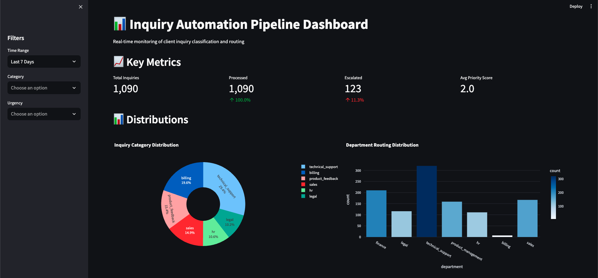
*Main inquiry monitoring dashboard showing real-time statistics and metrics*

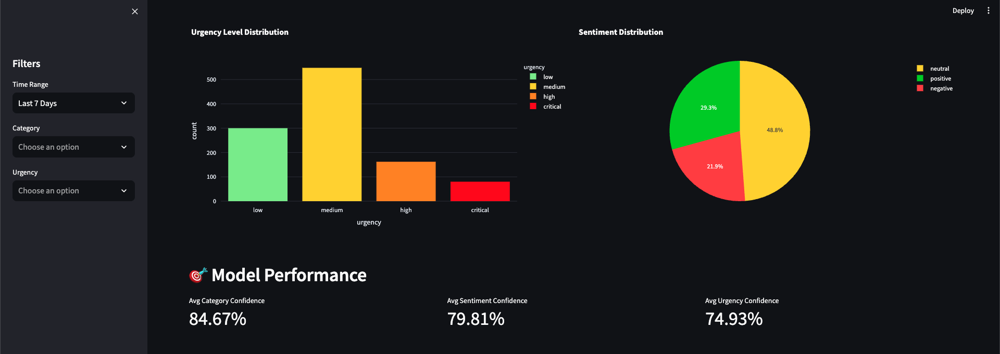
*Analytics view with inquiry trends and processing rates*

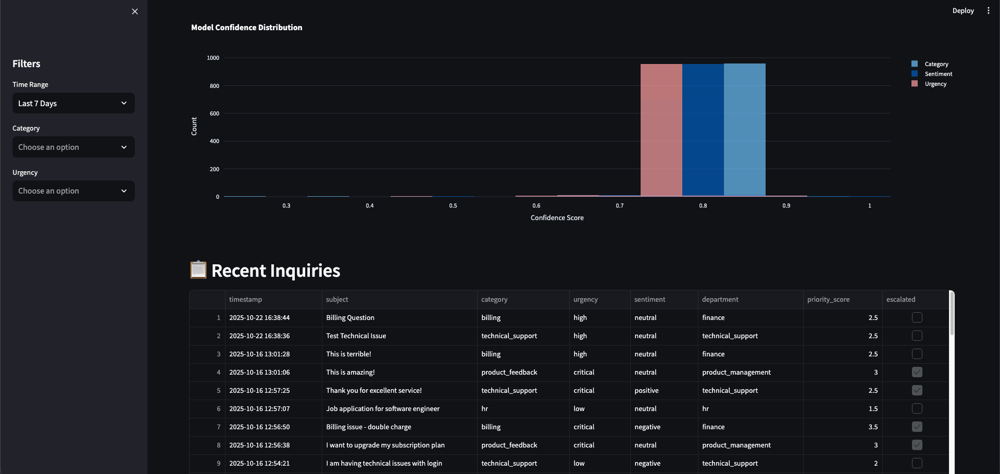
*Detailed view of inquiry classifications and urgency levels*

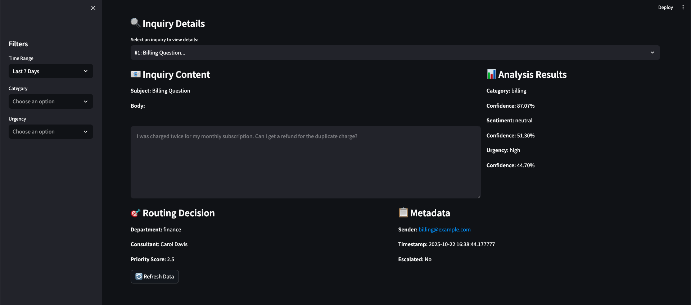
*Individual inquiry detail view with classification results*

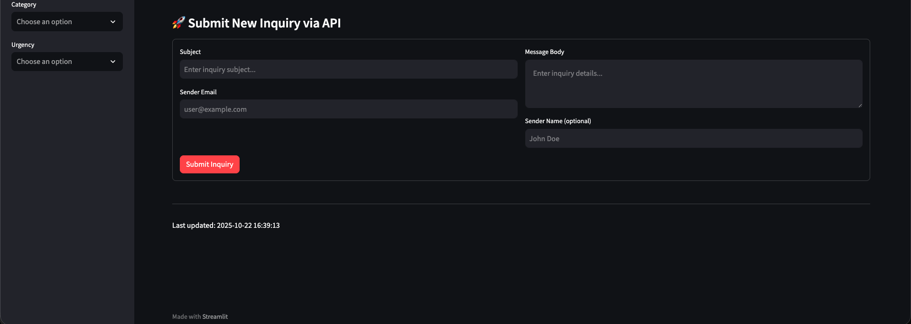
*Submit new inquiry form with validation*

### FastAPI Backend

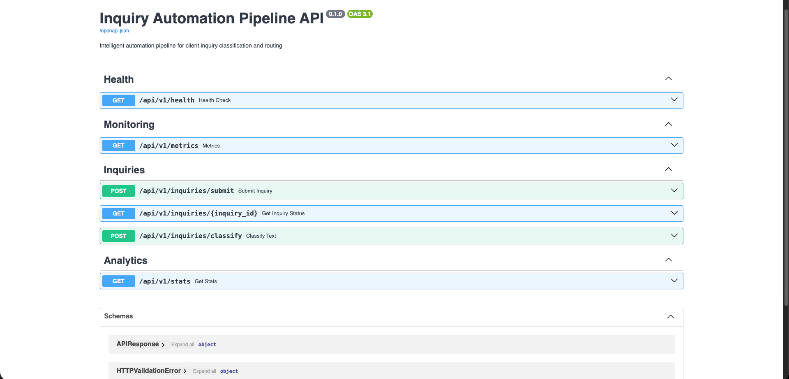
*FastAPI interactive API documentation (Swagger UI)*

### MLflow Model Tracking


*MLflow model registry and experiment tracking*

### Airflow Workflow Orchestration

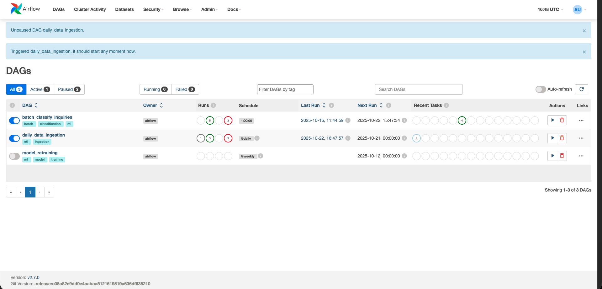
*Airflow DAG overview showing batch classification and model training workflows*

### ArgoCD GitOps

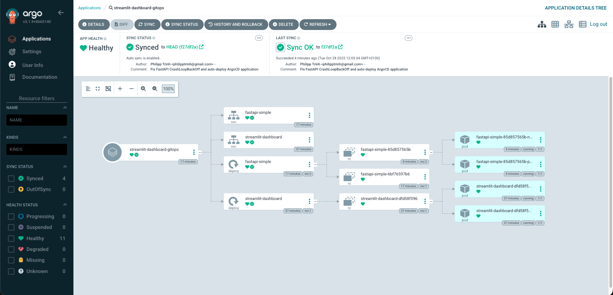
*ArgoCD dependency graph showing GitOps-managed Kubernetes resources with automatic sync*

### Grafana Monitoring Dashboards


*Kubernetes cluster-wide compute resource monitoring*

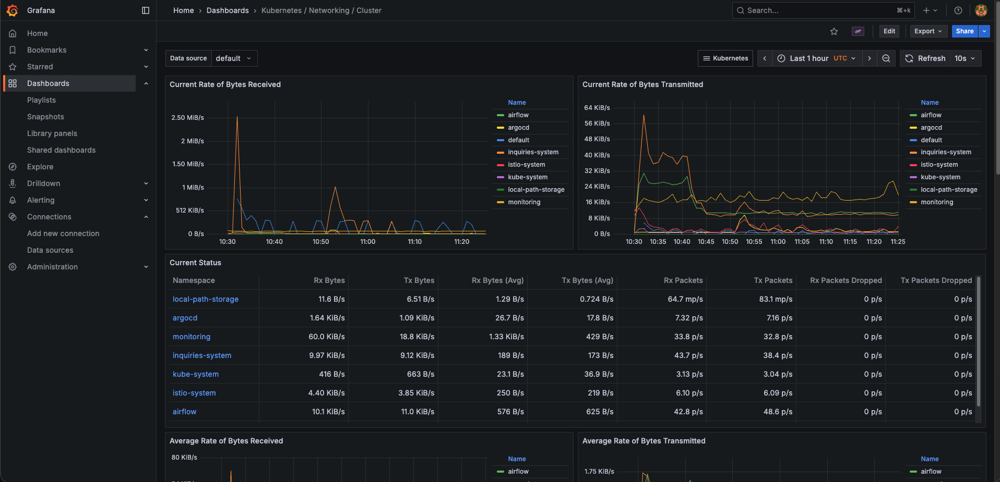
*Cluster networking and traffic monitoring with Istio integration*

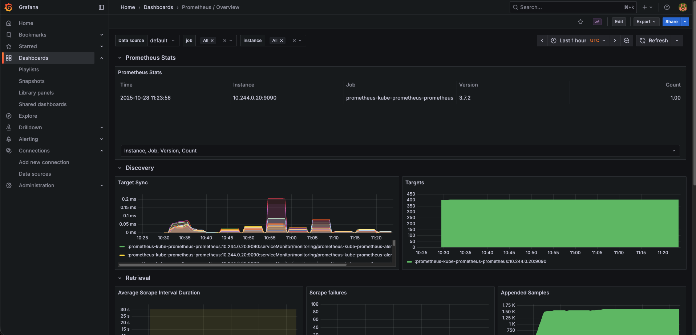
*Prometheus metrics and alerting overview*

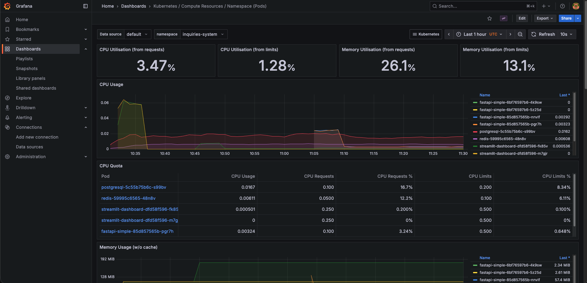
*Pod-level CPU and memory resource monitoring for inquiries-system namespace*

---

**Built with ❤️ using Cloud Native technologies** 🚀
